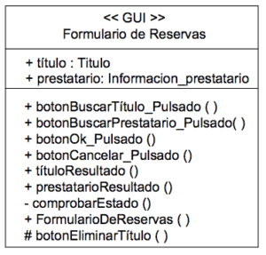

# Programación Orientada a Objetos (OOP)

## Clases

Son estructuras que sirven como una plantilla para crear **objetos** al definir sus propiedades (atributos) y comportamientos (métodos).

### Atributos

Son variables definidas dentro una clase que representan el estado de un objeto.

Existen *atributos de clase* que tienen un valor definido aún sin instanciar un objeto y que es común a todos los objetos de esa clase.

### Métodos

Son funciones definidas dentro de una clase que decriben el *comportamiento* de un objeto.

Debido a que es posible definir *métodos de clase* (que pueden ser ejecutadas sin haber instanciado un objeto), los métodos de un objeto se les identifica como *métodos de instacia*.

#### Constructor

## Objetos

Son **instancias** de una clase. Los valores de sus atributos son su estado.

## Herencia

Permite crear una nueva clase a partir de una clase existente, heredando sus propiedades y comportamientos.

Esto permite agrupar código común entre clases en una clase *padre* o **superclase** para evitar la repetición de código, las inconsistencias que se puede crear por accidente y facilitar el mantenimiento del código.

A las clases que heredan de otra clases, se las llaman clases *hijas* o **subclases**

En las subclases se pueden sobreescribir los métodos heredados y definir métodos propios.

### Clases Abstractas

## Polimorfismo (y sobrecarga)

La capacidad de un objeto para tomar diferentes formas, dependiendo del contexto en el que se utilice.

En lenguajes fuertemente tipados (no en Python), se deben declarar los tipos de datos que reciben las funciones como parámetros; en caso de las clases, gracias a la herencia y al polimorfismo, si una función espera un parámetro de una clase, se puede utilizar una subclase de esa clase sin generar errores.

En Python, el polimorfismo se aplica en función a lo que se conoce como *duck typing*, por lo que con que las diferentes clases tengan los mismos métodos que se quieren llamar es suficiente para que el código no falle.

##### Duck typing (tipado de pato)
>"Si camina como pato y grazna como pato, entonces es un pato."

## Encapsulación

Oculta los detalles internos de un objeto y solo expone los métodos necesarios para interactuar con él.

En algunos lenguajes (no en Python) se puede definir la *accesibilidad* de los atributos y métodos de las clases. Estos niveles de accesibilidad suelen ser:

- Privado: Sólo son accesibles dentro de la propia clase.
- Protegido: Son accesibles por la propia clase y clases derivadas.
- Público: Son accesibles fuera de la clase.

En Python se puede simular ese comportamiento agregando dos guiones bajos al principio de los nombres de clases y métodos que se quieran hacer privados.

## Abstracción

Presenta una visión simplificada de un objeto, enfocándose en sus características esenciales.

## Encapsulación

La encapsulación hace referencia al ocultamiento de los estado internos de una clase al exterior. Dicho de otra manera, encapsular consiste en hacer que los atributos o métodos internos a una clase no se puedan acceder ni modificar desde fuera, sino que tan solo el propio objeto pueda acceder a ellos.

## Interfaces (Clases abstractas)

# UML

## Diagrama de clases

En el diagrama de clases se representan las clases y sus relaciones entre ellas. En este diagrama se representan la estructura y comportamiento de los objetos (sus atributos y métodos).

Los elementos básicos son las **Clases** con sus **Atributos** y **Métodos**, y las **Relaciones** entre Clases.

Una clase se representa como un rectángulo, separado en tres partes por líneas horizontales en las cuales se especifican su nombre, sus atributos y sus métodos (en ese orden).

Delante de los atributos y métodos se representa su **visibilidad** que puede ser *privado* (+), *protegido* (#) o *público* (-).

La visibilidad privada significa que los atributos y métodos solo pueden ser accedidos por la propia clase.

La visibilidad protegida significa que los atributos y métodos pueden ser accedidos por la propia clase y por las clases derivadas.

La visibilidad pública significa que los atributos y métodos pueden ser accedidos fuera de la propia clase.

Python no posee un concepto de visibilidad pero se puede simular agregando dos guiones bajos al principio de los nombres de las clases y métodos que se quieren hacer privados (name mangling).

### Relaciones

Las relaciones se representan con una flecha cuyo trazo y punta varían según el tipo de relación.

Los tipos de relaciones son los siguientes:

- **Agregación**: Un objeto tiene otro objeto como parte de su estructura pero no comparten su ciclo de vida. Se representa con una línea sólida con punta de rombo sin pintar desde la clase agregada hasta la clase agregante.
- **Composición**: Un objeto tiene otro objeto como parte de su estructura y comparten su ciclo de vida. Se representa con una línea sólida con punta de rombo pintada desde la clase agregada hasta la clase agregante.
- **Herencia / Generalización**: Una clase hereda de otra. Se representa con una línea sólida con punta sin pintar desde la clase hija hasta la clase padre.

## Diagrama de casos de uso

## Diagrama de secuencia

Modelan la interacción entre los objetos en un caso de uso, ilustrando el orden en que se ejecutan las interacciones.

## Diagrama de Máquina de Estados
